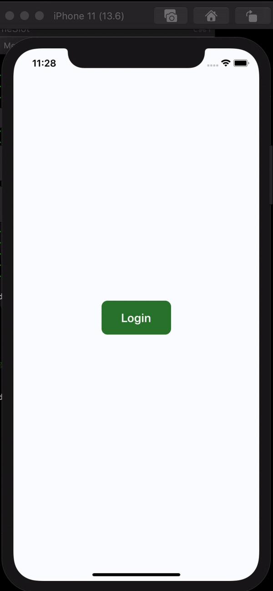
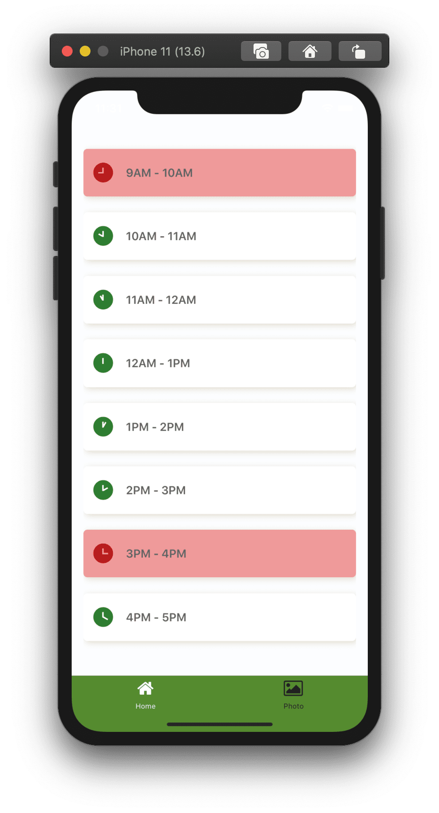
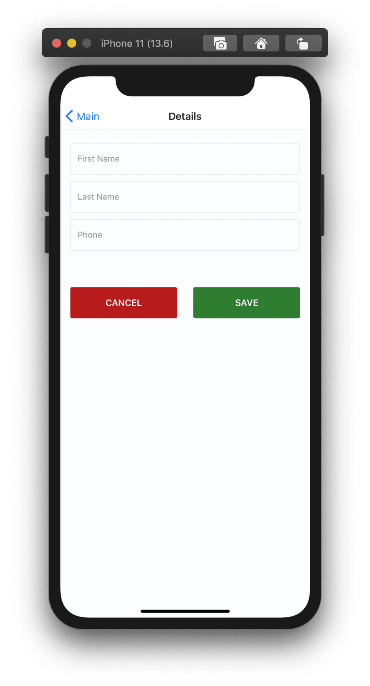
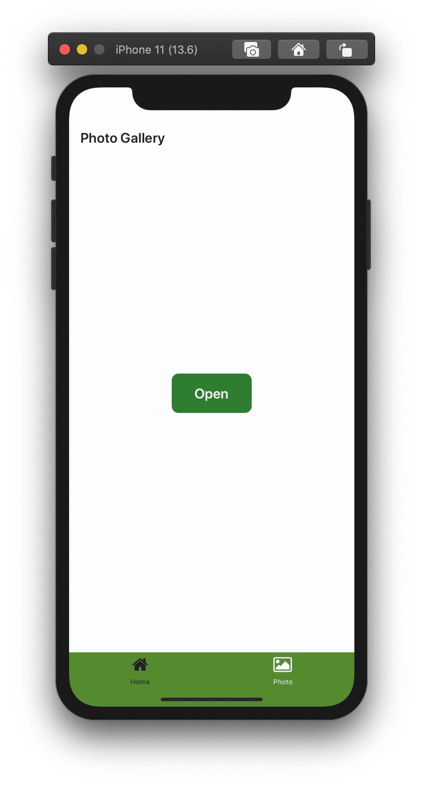
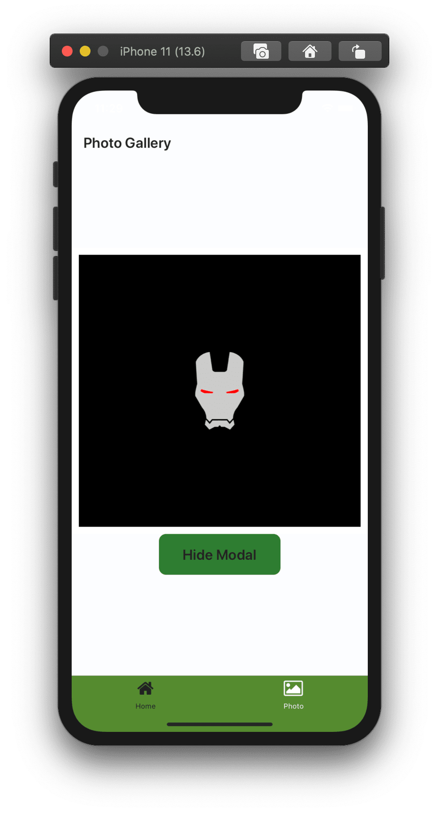

## Library used

- Navigation : React-Navigation 5.x.x
- CSS: styled-components 5.1.1
- Icons: react-native-vector-icons
- REDUX ? Sorry I prefer Hooks + Context Api Over redux for state management. Functional Components

## Getting Started

`$ yarn install`

### before running apps on iOS

`$ npx pod-install `

### Running your React Native application

- android

`$ npx react-native run-android`

- iOS

`$ npx react-native run-ios`

### Change default iOS Simulator

on root directory

`$ xcrun simctl list devices`

`$ npx react-native run-ios --simulator="iPhone 11"`

### Running on Device

https://reactnative.dev/docs/running-on-device

## React-Native Setup

Follow React-Native-CLI QuickStart

https://reactnative.dev/docs/getting-started

### CSS - Styled-component

https://styled-components.com/

### React-Navigation

https://reactnavigation.org/

### before running apps on iOS [not a recommend way]

`$ npx react-native link `

Errors comes while running iOS app due to duplicate of vector-icons fonts then follow: https://github.com/oblador/react-native-vector-icons/issues/1074

<!--  -->

